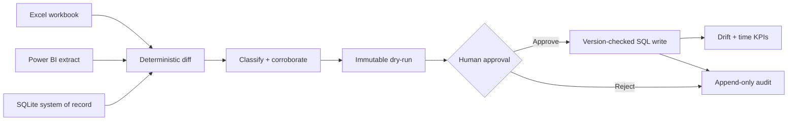
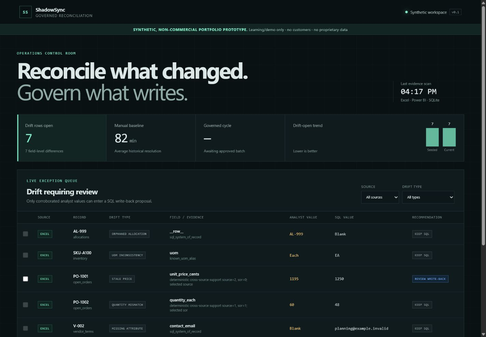
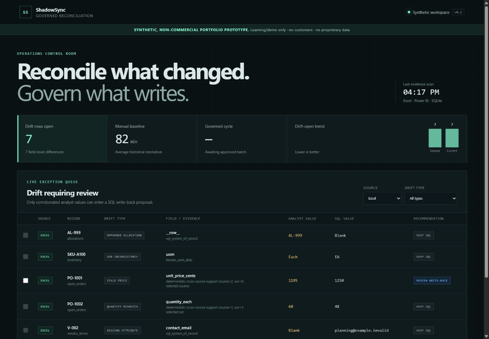
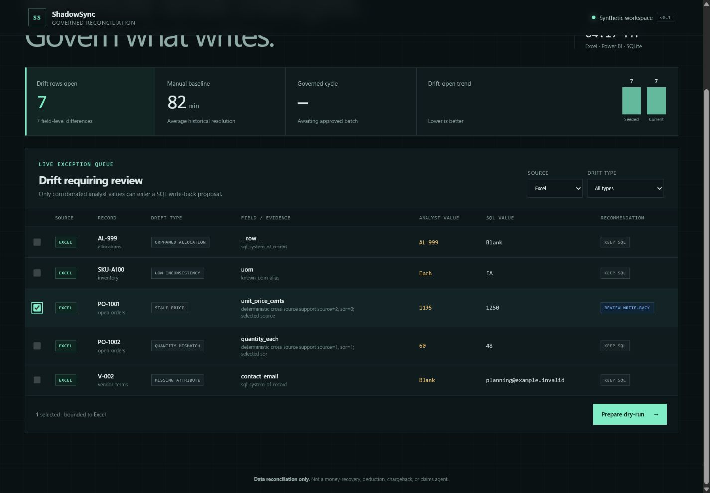
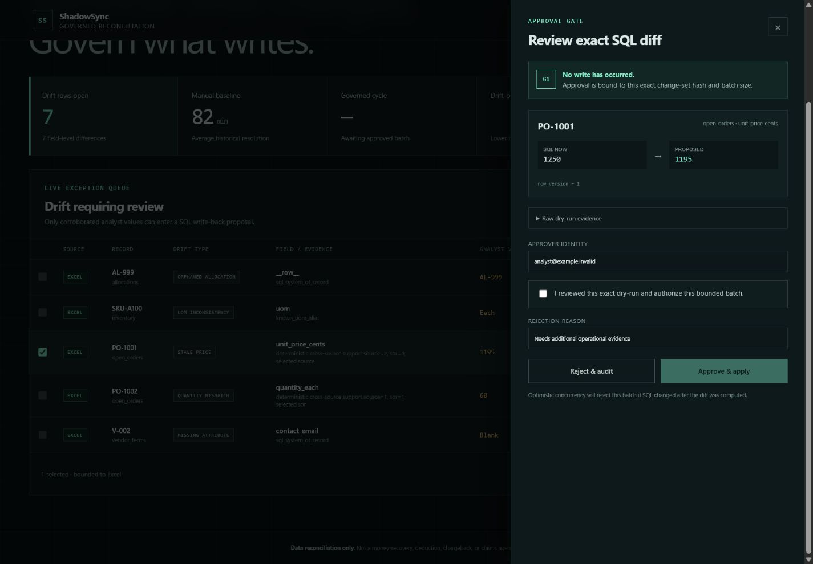
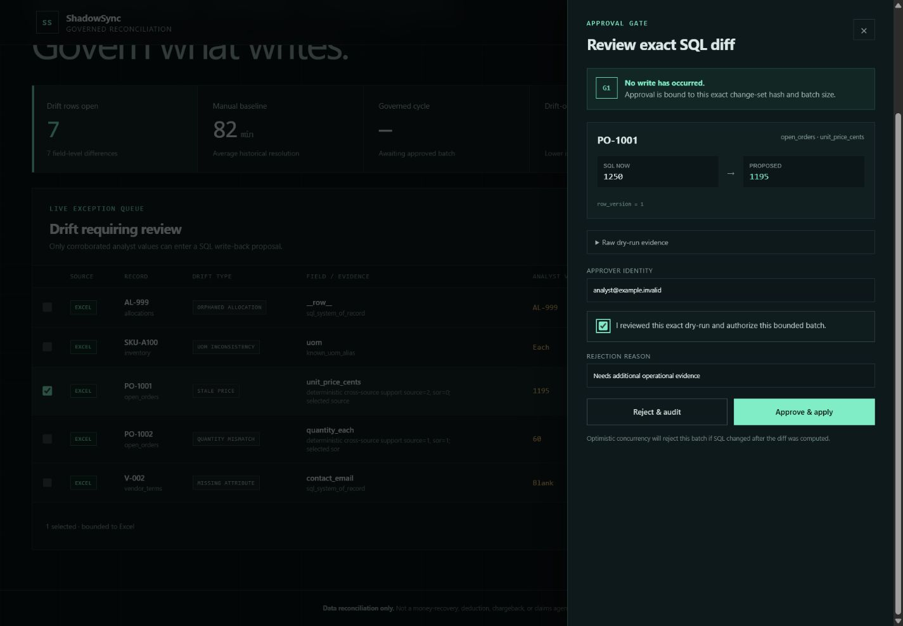
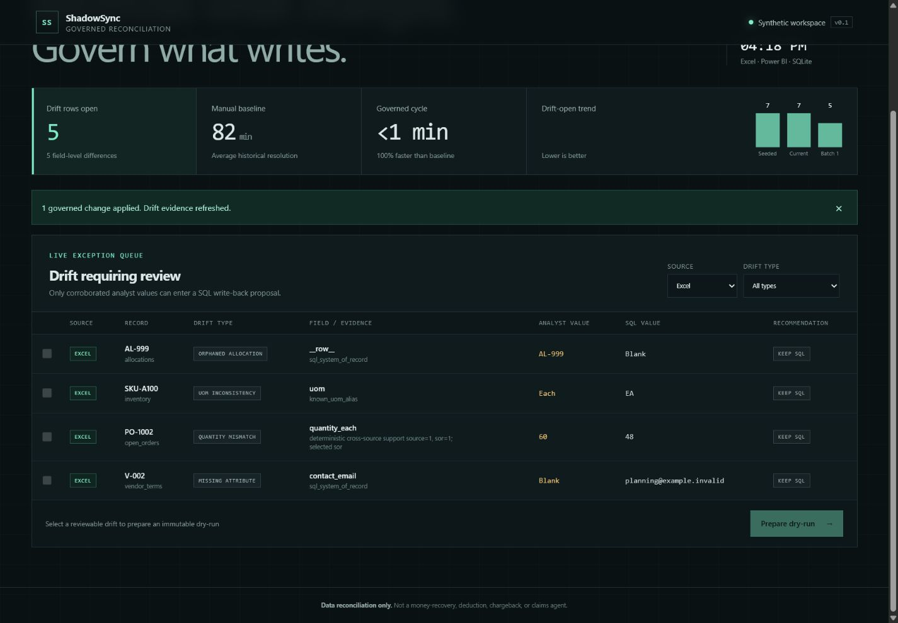
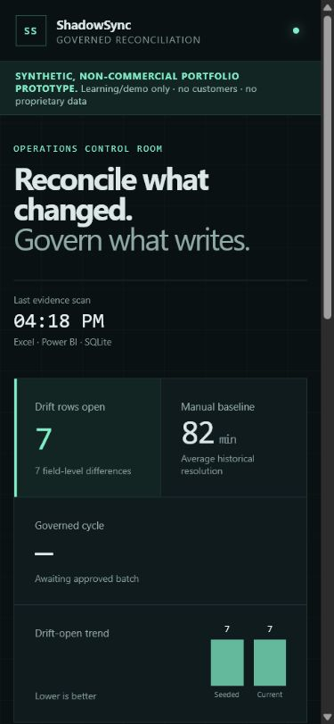
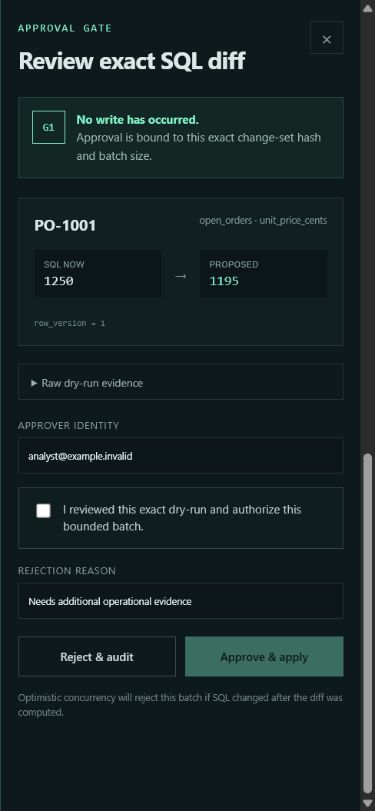

SYNTHETIC, NON-COMMERCIAL PORTFOLIO PROTOTYPE, learning/demo only, no customers, only synthetic data. Monetization content is analysis, not an offer.

# ShadowSync

**A governed Excel + Power BI ↔ SQL reconciliation and write-back agent.**

ShadowSync gives operations analysts one place to see where spreadsheet or BI extracts disagree with the SQL system of record, understand why, preview an exact change, and approve or reject a bounded write-back. The deterministic engine owns comparison, classification, policy, idempotency, concurrency, and KPI math. An optional structured resolver may propose an answer only for ambiguous drift; it can never approve or execute a write.

> **Boundary:** ShadowSync is **NOT a money-recovery, deduction, chargeback, or claims agent**. It never files a claim or acts against a counterparty. It reconciles synthetic operational data between analyst tools and a system of record.

## Why this exists

An open-order workbook says one price. A Power BI extract says another quantity. SQL has a third update timestamp. These disagreements become recurring “which number is real?” fire drills. ShadowSync turns that informal repair process into an observable control loop:



The fixed synthetic demo injects five drift types: stale price, orphaned allocation, quantity mismatch, unit-of-measure inconsistency, and missing attribute. Independent Excel and Power BI agreement supports one price correction; conflicting quantities stay SQL-authoritative rather than moving drift from one analyst tool to another.

## Seeded result

| Measure | Before approval | After approval |
|---|---:|---:|
| Drift rows open | 7 | 5 |
| Drift fields open | 7 | 5 |
| SQL fields written | 0 | 1 |
| Additional writes on replay | — | 0 |
| Manual baseline | 82 min | — |

The one approved write closes the corroborating Excel and Power BI price discrepancies. The remaining items are visible, classified, and deliberately not auto-written.

## Run with Docker

Prerequisite: Docker with the Compose plugin. No API key, proprietary connection, or external service is required.

```bash
docker compose up --build
```

Open [http://localhost:8000](http://localhost:8000). The first build resolves and caches image dependencies; subsequent `docker compose up` runs use the local `shadowsync:local` image with `pull_policy: never`. Runtime reconciliation itself is offline and all generated data stays in the `shadowsync-data` volume.

Reset the synthetic environment:

```bash
docker compose down --volumes
docker compose up --build
```

## Run locally

Requires Python 3.12, Node.js 22, and pnpm.

```bash
python -m venv .venv
# Windows: .venv\Scripts\activate
# macOS/Linux: source .venv/bin/activate
python -m pip install -e ".[dev]"

cd frontend
pnpm install --frozen-lockfile
pnpm build
cd ..

uvicorn shadowsync.api:app --host 0.0.0.0 --port 8000
```

The API serves the production React bundle at [http://localhost:8000](http://localhost:8000). For frontend development, run `pnpm dev` and use [http://localhost:5173](http://localhost:5173); Vite proxies `/api` to port 8000.

## Run the governed CLI demo

Dry-run only—this cannot write:

```bash
python -m shadowsync.demo --output-dir demo
```

After reading the printed diff, provide an attributable synthetic identity:

```bash
python -m shadowsync.demo --output-dir demo --approve-as portfolio-reviewer
```

The command regenerates the fixed dataset, requests a token bound to the exact dry-run and batch size, applies the approved field once, replays the same token to prove idempotency, and prints before/after KPIs.

## Governance guarantees

- **Deterministic first:** normalization, diffing, drift types, authority policy, proposals, hashes, writes, and KPI math contain no model decision.
- **AI is advisory and optional:** `resolve_ambiguous_drift` is the sole structured-resolver seam. The no-key fallback uses deterministic cross-source corroboration and defaults ties to SQL.
- **No invisible write:** approval requires a non-empty dry-run and an attributable actor. The HMAC token is bound to the exact change-set contents and maximum batch.
- **Bounded effect:** one change set contains at most 25 field updates from one source system. Browser clients submit drift IDs, not arbitrary SQL values.
- **Optimistic concurrency:** every target row and old field value are checked before the first mutation. A stale row aborts the whole transaction.
- **Idempotent replay:** applied change IDs are unique. Reusing a consumed token reports `IDEMPOTENT_REPLAY` with zero additional writes.
- **Append-only evidence:** audit events, approved change sets, and applied changes reject update and delete operations at the database layer.
- **Fail closed:** missing approval, tampering, duplicate drift, unsupported tables or fields, malformed input, and concurrency conflicts stop before mutation.

## Typed tool surface

| Tool | Writes? | Failure behavior |
|---|---|---|
| `ingest_excel(path)` | No | Rejects missing sheets/columns, blanks in required numeric fields, duplicate keys, unreadable/non-XLSX files |
| `ingest_bi_extract(path)` | No | Rejects unsupported formats, mixed/missing datasets, invalid schema, duplicate keys |
| `read_sql_sor(table)` | No | Uses a table allow-list; rejects missing database or unsupported table |
| `detect_drift(source, sor)` | No | Rejects duplicate normalized identities or mixed source systems |
| `classify_drift(drift)` | No | Uses deterministic policy; unresolved conflicts remain ambiguous |
| `resolve_ambiguous_drift(drift, context)` | No | Rejects non-ambiguous inputs or invalid structured resolver output |
| `propose_writeback(drift)` | No | Rejects empty, duplicate, mixed-source, oversized, or non-writeable proposals |
| `request_approval(change_set)` | Governance metadata only | Rejects missing identity/dry-run, tampering, or batch overflow |
| `apply_writeback(change_set, token)` | Yes | Atomically rejects invalid tokens, stale versions/values, or non-allow-listed targets |
| `observe_outcome()` | No | Computes source-specific open drift and reconciliation-time KPIs |
| `escalate(reason)` / `emit_audit(event)` | Audit only | Requires attribution; duplicate event IDs fail closed |

## Repository map

```text
src/shadowsync/
  api.py          FastAPI orchestration and static UI serving
  demo.py         explicit-approval seeded CLI walkthrough
  drift.py        deterministic diff and classification
  governance.py   resolution, dry-run, approval, write-back, KPIs, audit
  ingest.py       typed Excel, CSV/parquet, and SQLite normalization
  models.py       immutable contracts and enums
  schema.sql      system-of-record and append-only governance schema
  seed.py         reproducible synthetic generators
frontend/         React + TypeScript analyst workspace
tests/            deterministic, governance, API, and demo tests
.github/workflows CI for Python 3.12, frontend tests/build, and Docker smoke
```

SQLite is used for a portable portfolio demonstration. Repository access is isolated behind typed ingestion and governance functions, and the schema uses explicit business keys and row versions to keep a later Postgres adapter straightforward.

## Test and validation

```bash
pytest
cd frontend && pnpm test && pnpm build
```

CI runs the backend suite on Python 3.12, the React test suite and production build on Node 22, then builds the container and probes `/api/health`. The host used to create this project did not have Docker, so the Docker build is intentionally validated in CI.

The test suite specifically covers all five drift types, null normalization, CSV/parquet parity, cross-source drift IDs, approval attribution, dry-run integrity, token tampering, batch bounds, atomic concurrency rejection, idempotent replay, audit immutability, API rejection, schema migration, and KPI reduction without creating drift in another source.

## Product tour

### 1. Analyst control room


### 2. Excel exceptions


### 3. Corroborated stale-price evidence


### 4. Immutable dry-run gate


### 5. Attributable approval confirmation


### 6. Observed KPI outcome


### 7. Responsive mobile control room


### 8. Responsive mobile approval gate


All screenshots show only fixed synthetic data.

## Interview talking points

- **Why not let an LLM choose?** Operational authority and write safety are policy problems. The model seam is restricted to proposing a structured answer for ambiguity; deterministic validation plus human approval controls effect.
- **What makes approval meaningful?** The token signs the exact canonical change list, actor, timestamp, and bound. Editing any field after approval invalidates the request.
- **How is the race handled?** The engine validates every old value and row version inside `BEGIN IMMEDIATE` before any update. One stale row rolls back the batch.
- **How is “success” measured?** ShadowSync recomputes drift from both analyst sources after the write. The demo closes two observed discrepancies with one SQL change and introduces no new drift IDs.
- **What did testing catch?** Connection-scoped SQLite foreign keys, overconfident authority classification, pre-approval change-set tampering, drift displacement between Excel and BI, stale schema startup, ambiguous accessibility labels, and premature success messaging.
- **What would production add?** Enterprise identity, Postgres-backed durable proposal state, object storage for source snapshots, organization-specific authority policies, signed deployment secrets, observability export, and role-based approval thresholds.

## Non-commercial portfolio note

This repository demonstrates technical and product reasoning for learning and interviews. It has no customers, contains no proprietary data, and makes no commercial offer. Any discussion of operational value or future production capabilities is analysis only.
